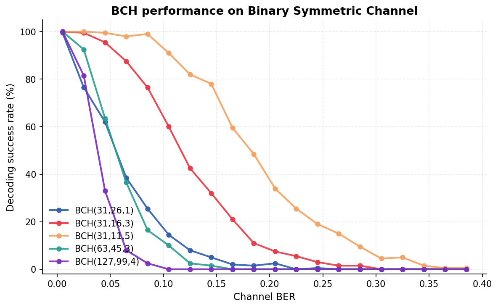

# BCH-симулятор

Курсовий проєкт з дискретної математики, УКУ, ІІ семестр.
Тема: Проєкт А — коди Боуза–Чоудхурі–Хоквінгема (BCH).

Реалізація з нуля бінарних BCH-кодів: поле Галуа $\mathrm{GF}(2^m)$, алгоритм Берлекемпа–Мессі, симулятор шумного каналу та візуалізація виправлення помилок.

## Швидкий старт

```bash
pip install -r requirements.txt

# Демонстрація з командного рядка
python -m apps.cli simulate --m 5 --t 3 --ber 0.05

# Інтерактивний дашборд
streamlit run apps/web/app.py

# Згенерувати графік
python -m analysis.benchmarks
```

## Структура

```
core/
  galois.py       поле Галуа GF(2^m)
  polynomial.py   поліноми над GF(2) і GF(2^m)
  bch.py          кодер, декодер, Берлекемп–Мессі, матриці H та G
  channel.py      бінарний симетричний канал

apps/
  cli.py          командний інтерфейс на argparse
  web/app.py      Streamlit-дашборд

analysis/
  benchmarks.py   графік успішності декодування

examples/
  quickstart.py   мінімальний приклад використання
  plots/          згенеровані графіки
```

## Теоретична база

### Поле Галуа $\mathrm{GF}(2^m)$

Скінченне поле з $2^m$ елементами. Елементи представляються як цілі числа в $[0, 2^m-1]$, де біт $i$ — коефіцієнт при $x^i$ у поліноміальному представленні. Додавання — XOR, множення через таблиці логарифмів за основою примітивного елемента $\alpha$.

### BCH-коди

Код $\mathrm{BCH}(n, k, t)$ має довжину блоку $n = 2^m - 1$, повідомлення довжини $k$, і гарантовано виправляє до $t$ помилок. Породжуючий поліном:

$$g(x) = \mathrm{lcm}\bigl(M_{\alpha}(x),\, M_{\alpha^2}(x),\, \ldots,\, M_{\alpha^{2t}}(x)\bigr)$$

де $M_a(x)$ — мінімальний поліном елемента $a$ над $\mathrm{GF}(2)$.

### Перевірочна матриця

Кодові слова — це вектори $c$ з $c(\alpha^i) = 0$ для $i = 1, \ldots, 2t$. Це дає матрицю

$$H_{ij} = \alpha^{(i+1) \cdot j}, \quad i = 0, \ldots, 2t-1,\ j = 0, \ldots, n-1$$

розміру $2t \times n$ над $\mathrm{GF}(2^m)$.

### Кодування

Систематичне: $c(x) = x^{n-k} \cdot m(x) + \bigl[x^{n-k} m(x) \bmod g(x)\bigr]$.

### Декодування

Класичний пайплайн з трьох кроків:

1. **Синдроми:** $S_i = r(\alpha^i)$ для $i = 1, \ldots, 2t$. Якщо всі нулі — помилок немає.
2. **Berlekamp–Massey:** будує локаторний поліном $\Lambda(x) = \prod (1 - X_j x)$ мінімального степеня. Складність $O(t^2)$.
3. **Пошук Чейна:** перебір позицій $j$, для яких $\Lambda(\alpha^{-j}) = 0$. Це позиції помилок.

Корекція — XOR у знайдених позиціях.

## Результати



Висновки:
- Більший $t$ виправляє більший рівень шуму, але ціною меншої швидкості $k/n$.
- BCH-коди ефективні в зоні низького-середнього BER.
- Алгоритм Берлекемпа–Мессі робить декодування практичним: складність $O(t^2)$ навіть для довгих кодів.

## Розподіл ролей у команді

| Учасник | Внесок |
|---|---|
| Артем Сергійчук | Поле Галуа, поліноми |
| Іван Богатирьов | BCH-кодек |
| Данило Ришко | Канал, бенчмарки |
| Максим Киба | Інтерфейс, документація |

## Джерела

- Lin, Costello. *Error Control Coding*. 2nd ed. Prentice Hall, 2004.
- [BCH code](https://en.wikipedia.org/wiki/BCH_code) на Wikipedia.
